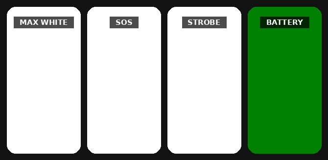

<div align="center">



# Rescue Light

**Turns a phone screen into an emergency signal light.**
Full brightness, edge to edge, 17 KB, no permissions.

</div>

<br>

**Tap** to change mode, **long-press** to enable a loud alarm tone. Both preferences are stored.

| Mode | Light | Why |
|------|-------|-----|
| **Max white** | steady white | the most photons a screen can emit, seen farthest at night |
| **SOS** | Morse `···———···` | reads as deliberate distress, not ambient light |
| **Strobe** | flash, ~1 Hz | the distress cadence; flicker catches the eye before it focuses |
| **Battery** | green, 9% duty | green is cheap on OLED and near the night-adapted eye's peak, ~3× runtime |

The tone is synthesized in code (no audio files) on the alarm stream, so it sounds
even on silent. Sound and light pulse together.

## Build

```
node apkbuild.js              # → build/app.apk
adb install -r build/app.apk
```

`apkbuild.js` compiles the manifest, `src/` and `res/` into a signed APK with
the Android SDK tools. Requires JDK and SDK build-tools.

Release key at `~/.apkbuild/keys/<package>.jks`, with its password in a sibling `.pass` file.

## Disclaimer

Not a certified safety device, carry proper equipment. Signal distress only in
a genuine emergency; false alarms are a criminal offence. Flashing modes may
affect photosensitive people; the tone is loud. No warranty, use at your own
risk, see [LICENSE](LICENSE).
